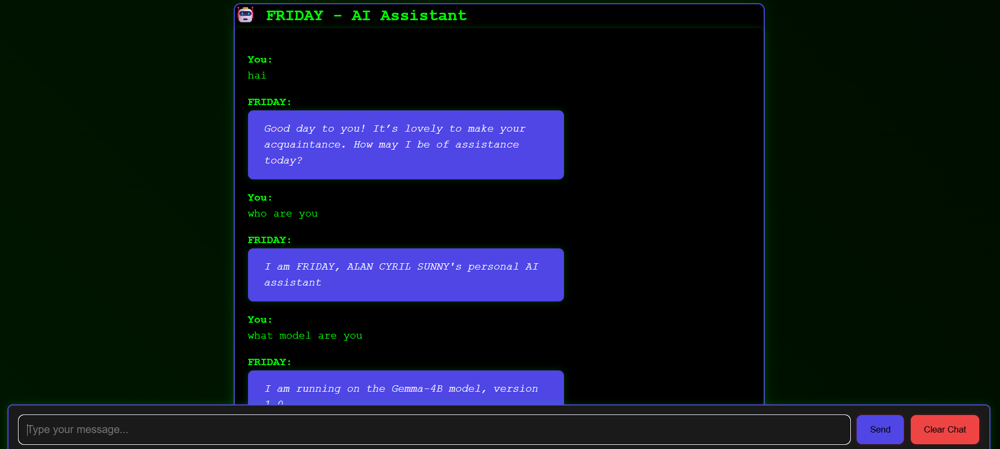

# 🤖 FRIDAY - Your Personal AI Assistant

[](https://opensource.org/licenses/MIT)
[](https://www.python.org/downloads/)
[](https://flask.palletsprojects.com/)

FRIDAY is your sophisticated AI assistant, inspired by the iconic AI from Iron Man/Avengers. Built with modern web technologies and powered by the cutting-edge Gemma-4B language model, FRIDAY offers a seamless and engaging chat experience with persistent conversation history.

## 🎯 Key Features

- 🤖 **Modern Chat Interface**: Clean, intuitive design that works on any device
- 💾 **Persistent History**: Never lose your conversations with SQLite database
- 🔄 **Real-time AI**: Instant responses powered by Gemma-4B
- 📝 **Easy Controls**: Quick chat clearing and message management
- 📱 **Mobile Ready**: Perfect for both desktop and mobile
- 💅 **Cyberpunk Aesthetic**: Purple and cyan accents for that futuristic feel
- 📝 **Natural Flow**: Conversations that feel real, not robotic

## 📸 Application Preview



## 🚀 Quick Start

1. **Clone the Repository**
```bash
git clone https://github.com/yourusername/friday-ai-assistant.git
cd friday-ai-assistant
```

2. **Install Dependencies**
```bash
pip install -r requirements.txt
```

3. **Run LM Studio**
   - Start LM Studio with Gemma-4B model on port 1234

4. **Launch FRIDAY**
```bash
python app.py
```

5. **Access FRIDAY**
   - Open your browser and navigate to `http://localhost:5000`

## 📱 How to Use

1. **Type Your Message**
   - Enter your query in the input field
   - Press Enter or click Send to send

2. **Interact with FRIDAY**
   - Receive instant responses with FRIDAY's sophisticated personality
   - Messages are automatically saved

3. **Manage Your Chat**
   - Use the Clear Chat button to reset the conversation
   - All messages are securely stored in the database

## Configuration

The application uses the following environment variables:

- `LM_API_URL`: URL of the LM Studio API (default: http://localhost:1234/v1/chat/completions)
- `MODEL_NAME`: Language model name (default: gemma:4b)

## Contributing

1. Fork the repository
2. Create your feature branch (`git checkout -b feature/amazing-feature`)
3. Commit your changes (`git commit -m 'Add some amazing feature'`)
4. Push to the branch (`git push origin feature/amazing-feature`)
5. Open a Pull Request

## 📁 Project Structure

```
friday-ai-assistant/
├── app.py              # Main Flask application
├── templates/          # HTML templates
├── static/             # CSS, JavaScript, and assets
├── database.py         # Database operations
├── requirements.txt    # Python dependencies
└── README.md          # Project documentation
```

## License

This project is licensed under the MIT License - see the [LICENSE](LICENSE) file for details.

## Acknowledgments

- Created by ALAN CYRIL SUNNY
- Powered by Gemma-4B language model
- Inspired by FRIDAY from Iron Man/Avengers universe

## Support

For support, please contact ALAN CYRIL SUNNY or open an issue in the GitHub repository.

## Contributing

Contributions are welcome! Please read our [Contributing Guidelines](CONTRIBUTING.md) before submitting a pull request.

## Technical Details

- **Backend**: Flask web framework
- **Frontend**: HTML5, CSS3, JavaScript
- **Language Model**: Gemma-4B
- **Database**: SQLite
- **UI Theme**: Cyberpunk-inspired with purple and cyan accents
